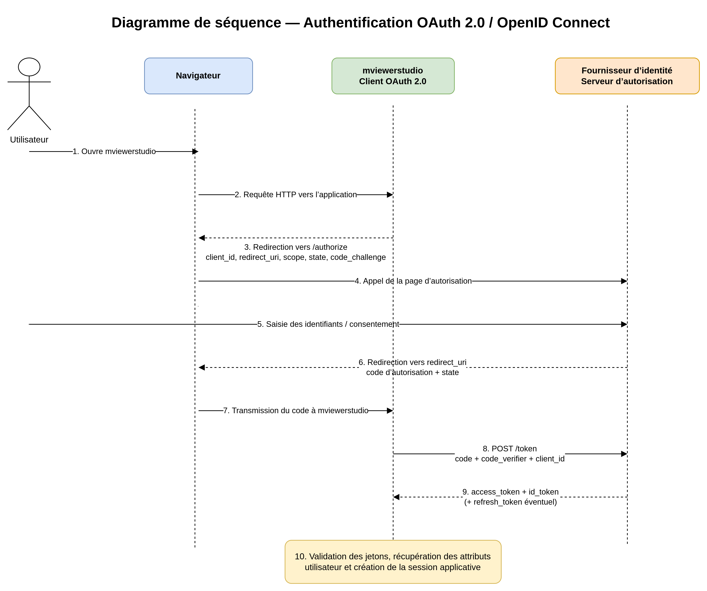

.. Authors :
.. mviewer team

.. _what_is_oauth2:

Mviewerstudio et OAuth 2.0 / OIDC
=================================

Cette page explique simplement à quoi sert OAuth 2.0 dans mviewerstudio.
L'objectif n'est pas de détailler tout le protocole, mais de donner les repères utiles pour comprendre les pages de configuration.

Qu'est-ce qu'OAuth 2.0 ?
------------------------

OAuth 2.0 est un standard qui permet à une application de déléguer l'authentification à un service spécialisé.

Dans le cas de mviewerstudio, cela signifie généralement :

- l'utilisateur se connecte sur un fournisseur d'identité déjà en place, par exemple Keycloak ou GeoNode ;
- mviewerstudio ne gère pas lui-même le mot de passe ;
- après connexion, mviewerstudio reçoit les informations nécessaires pour reconnaître l'utilisateur.

En pratique, OAuth 2.0 évite de multiplier les comptes et les formulaires de connexion propres à chaque application.

Pourquoi utiliser OAuth 2.0 ?
-----------------------------

Pour mviewerstudio, OAuth 2.0 apporte surtout trois bénéfices :

- centraliser la connexion des utilisateurs dans un outil dédié ;
- simplifier l'administration des accès ;
- améliorer la sécurité en évitant que mviewerstudio stocke ou traite directement les mots de passe.

Cela permet aussi d'aligner mviewerstudio avec le reste de votre système d'information si d'autres applications utilisent déjà un annuaire ou un fournisseur d'identité.

Concepts clés
-------------

Voici les termes les plus utiles à connaître :

- ``Utilisateur`` : la personne qui veut accéder à mviewerstudio.
- ``mviewerstudio`` : l'application que l'utilisateur veut utiliser.
- ``Fournisseur d'identité`` : le service qui gère la connexion, par exemple Keycloak, GeoNode ou un autre serveur compatible OAuth 2.0 / OIDC.
- ``Client`` : le nom donné à mviewerstudio lorsqu'il est déclaré auprès du fournisseur d'identité.
- ``SSO`` : signifie ``Single Sign-On``. En français, on parle souvent d'authentification unique. Cela permet à un utilisateur de se connecter une seule fois pour accéder ensuite à plusieurs applications compatibles, sans ressaisir son mot de passe à chaque fois. Dans un environnement moderne, ce fonctionnement s'appuie souvent sur OAuth 2.0 et surtout sur OpenID Connect pour transmettre l'identité de l'utilisateur entre les applications.
- ``Token`` : un jeton transmis après la connexion pour prouver qu'un accès a été accordé.
- ``Scope`` : la liste des informations ou permissions demandées.
- ``Redirect URI`` : l'URL de retour vers mviewerstudio après la connexion.

Il n'est pas nécessaire de tout retenir par coeur. L'important est de comprendre qu'un service externe authentifie l'utilisateur, puis transmet à mviewerstudio ce qu'il faut pour ouvrir la session.

Comment fonctionne OAuth 2.0 ?
------------------------------

Vue d'ensemble
^^^^^^^^^^^^^^

Le fonctionnement général peut se résumer ainsi :

1. L'utilisateur ouvre mviewerstudio.
2. mviewerstudio redirige l'utilisateur vers le fournisseur d'identité.
3. L'utilisateur se connecte sur cette page externe.
4. Le fournisseur d'identité confirme la connexion et renvoie l'utilisateur vers mviewerstudio.
5. mviewerstudio récupère les informations utiles pour créer la session applicative.

Vu côté utilisateur, l'expérience est souvent simplement : cliquer sur ``Se connecter``, s'authentifier sur une page connue, puis revenir dans mviewerstudio déjà connecté.

Ce que cela change dans mviewerstudio
^^^^^^^^^^^^^^^^^^^^^^^^^^^^^^^^^^^^^

OAuth 2.0 peut être intégré de deux grandes façons dans mviewerstudio :

- directement par l'application, avec le mode ``authlib`` ;
- indirectement via un composant intermédiaire comme ``oauth2-proxy``, souvent utilisé avec Keycloak.

Dans les deux cas, l'idée reste la même : mviewerstudio s'appuie sur un service externe pour savoir qui est l'utilisateur. En revanche, le point important est de comprendre où se fait réellement la gestion de la connexion.

Mode ``authlib``
""""""""""""""""

Dans ce mode, mviewerstudio dialogue lui-même avec le fournisseur d'identité.

Concrètement :

- mviewerstudio redirige l'utilisateur vers la page de connexion ;
- mviewerstudio reçoit le retour du fournisseur d'identité ;
- mviewerstudio récupère les informations de session et les informations utilisateur ;
- mviewerstudio décide ensuite si l'utilisateur peut entrer, par exemple selon ses groupes autorisés.

Ce mode est souvent plus simple à comprendre lorsqu'on veut une intégration directe entre mviewerstudio et un fournisseur compatible OIDC, par exemple GeoNode.

Mode via ``oauth2-proxy``
"""""""""""""""""""""""""

Dans ce mode, mviewerstudio n'échange pas directement avec le fournisseur d'identité pendant la connexion utilisateur. Un composant intermédiaire, souvent placé devant l'application, s'en charge.

Concrètement :

- l'utilisateur arrive d'abord sur un proxy d'authentification ;
- ce proxy dialogue avec le fournisseur d'identité ;
- une fois l'utilisateur connecté, le proxy transmet à mviewerstudio des en-têtes contenant l'identité utilisateur ;
- mviewerstudio lit ces en-têtes pour savoir qui est connecté.

Autrement dit, mviewerstudio fait confiance au proxy placé devant lui pour transmettre une identité déjà vérifiée.

Différence pratique
"""""""""""""""""""

Pour un administrateur, la différence principale est la suivante :

- avec ``authlib``, la logique OAuth 2.0 est portée par mviewerstudio lui-même ;
- avec ``oauth2-proxy``, la logique OAuth 2.0 est externalisée dans un composant intermédiaire de l'infrastructure.

Le mode ``authlib`` convient bien lorsqu'on veut une relation directe entre mviewerstudio et le fournisseur d'identité, avec une configuration concentrée dans l'application.

Le mode ``oauth2-proxy`` convient bien lorsqu'on a déjà une architecture avec reverse proxy, mutualisation de la sécurité, ou plusieurs applications protégées de la même manière.

Dans les deux cas, l'utilisateur voit souvent une expérience proche. La différence se situe surtout côté architecture et administration.

Exemple simple
^^^^^^^^^^^^^^

Exemple fréquent dans un déploiement mviewerstudio :

- un administrateur configure mviewerstudio pour utiliser Keycloak ou la gateway geOrchestra ;
- un utilisateur ouvre mviewerstudio ;
- il est redirigé vers la page de connexion du fournisseur d'identité ;
- après authentification, il est redirigé vers mviewerstudio avec ses informations (selon le fournisseur : nom, email, roles, organisation, etc..) .

Les groupes retournés par le fournisseur d'identité (Keycloak) peuvent ensuite servir à décider qui a le droit d'accéder à l'application (selon la configuration mviewerstudio).

Les différents flux
-------------------

OAuth 2.0 prévoit plusieurs manières de dialoguer entre l'application et le fournisseur d'identité. Pour un lecteur débutant, il n'est pas nécessaire de tous les connaître en détail.

Le plus important à retenir est le suivant :

- pour une application web comme mviewerstudio, le flux le plus courant est ``Authorization Code`` ;
- lorsqu'il est possible, on lui associe la protection ``PKCE`` ;
- d'autres flux existent, mais ils sont moins fréquents pour ce cas d'usage.

En pratique, si vous configurez mviewerstudio avec un fournisseur moderne, vous utiliserez presque toujours le mécanisme recommandé par défaut par ce fournisseur.

Les tokens
----------

Un token est un jeton que le fournisseur d'identité remet après la connexion.

Dans la pratique, trois notions reviennent souvent :

- ``Access Token`` : permet d'accéder à certaines ressources ou API ;
- ``Refresh Token`` : permet d'obtenir un nouveau token sans redemander immédiatement une connexion complète ;
- ``ID Token`` : décrit l'identité de l'utilisateur, surtout lorsqu'on utilise OpenID Connect.

Pour un administrateur mviewerstudio débutant, le point clé est simple :

mviewerstudio exploite ces informations pour identifier l'utilisateur, récupérer son profil et, selon la configuration, ses groupes ou rôles.

Il n'est pas recommandé de manipuler ces tokens à la main sans besoin précis. Leur durée de vie, leur format et leur stockage doivent rester gérés par les composants prévus à cet effet.

.. warning::

    Par défaut, certains fournisseurs ne retournent pas les informations suffisantes dans le token.
    C'est le cas par exemple de Geonode via Django-oauth2-toolkit. Vous devrez alors configurer le fournisseur pour qu'il retourne les informations utiles (claims).

OAuth 2.0 vs OpenID Connect (OIDC)
----------------------------------

Ces deux termes sont souvent cités ensemble, mais ils ne désignent pas exactement la même chose.

- OAuth 2.0 sert surtout à déléguer un accès.
- OpenID Connect (OIDC) ajoute une couche d'identité au-dessus d'OAuth 2.0.

Autrement dit :

- OAuth 2.0 répond à la question : ``une application peut-elle obtenir un accès ?``
- OIDC répond à la question : ``qui est l'utilisateur connecté ?``

Dans mviewerstudio, dès qu'on veut récupérer proprement des informations utilisateur comme le nom, l'email ou les groupes, on parle très souvent d'OIDC en plus d'OAuth 2.0.

Ce qu'il faut retenir pour mviewerstudio
----------------------------------------

Pour bien aborder la configuration de mviewerstudio, retenez surtout ceci :

- mviewerstudio ne doit pas gérer seul les mots de passe des utilisateurs ;
- un fournisseur d'identité externe réalise l'authentification ;
- mviewerstudio récupère ensuite une identité déjà validée ;
- les informations transmises peuvent inclure le nom de l'utilisateur, son email et ses groupes ;
- selon l'architecture choisie, l'intégration se fait soit directement dans mviewerstudio, soit via un proxy d'authentification.

Avec ces bases, vous pouvez ensuite lire plus facilement les pages de configuration dédiées à votre cas d'usage.

Aller plus loin
---------------

Pour passer de la compréhension générale à la mise en oeuvre :

- consultez :ref:`how_to_geonode` si vous utilisez GeoNode comme fournisseur d'identité ;
- consultez :ref:`install_python` pour les variables d'environnement liées à l'authentification ;
- consultez :ref:`install_docker` si votre déploiement mviewerstudio est conteneurisé.

Glossaire
---------

``Authentification``
    Action qui consiste à vérifier l'identité d'un utilisateur.

``Autorisation``
    Action qui consiste à décider ce qu'un utilisateur a le droit de faire.

``Client``
    Application déclarée auprès du fournisseur d'identité. Ici, il peut s'agir de mviewerstudio.

``Fournisseur d'identité``
    Service qui gère la connexion des utilisateurs.

``OIDC``
    Extension d'OAuth 2.0 orientée identité utilisateur.

``PKCE``
    Mécanisme de protection supplémentaire utilisé avec certains flux OAuth 2.0.

``Redirect URI``
    URL de retour utilisée après la connexion.

``Token``
    Jeton remis après authentification pour prouver qu'un accès a été accordé.

Références et documentations officielles
----------------------------------------

- OAuth 2.0 : https://oauth.net/2/
- OpenID Connect : https://openid.net/developers/how-connect-works/
- Keycloak : https://www.keycloak.org/documentation
- Django OAuth Toolkit : https://django-oauth-toolkit.readthedocs.io/
- Configuration des claims Django : https://django-oauth-toolkit.readthedocs.io/en/latest/oidc.html
